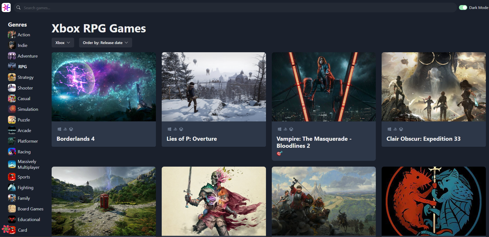
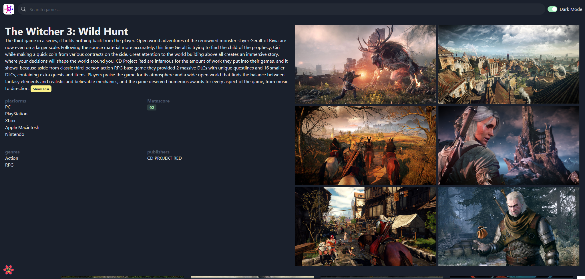

# About

This web application called "GameHub" that allows users to browse and search for video games. It fetches the video games data from [RAWG](https://rawg.io/).




[](https://github.com/kevinleungdev/GameHub.git)

## Features

- Displaying a list of games with their details, including platforms, genres, publishers, and critic scores.
- Allowing users to filter games by genre and platform.
- Sorting games by various criteria such as relevance, data added, name, release date, popularity, and average rating.
- Searching games by name.
- Viewing detailed information about a specific game, including a description, attributes, screenshots, and trailers.
- Switching between light and dark modes using a color mode switch.

## Tech Stack

- React 18
- Chakra UI 2.8
- Tanstack Query 4.28
- Zustand 4.3

# Running the application

You can run the application with two ways:

1. The easiest way: run it pre-configured in cloud IDE [GitPod](https://gitpod.io/)
2. Run it locally

## Run in GitPod

To run the application in GitPod, simply click on the "Open in GitPod" button at the top of this README.

- Note that you need a (free) GitPod account.
- And please make sure that you allow your browser opening new tabs/windows from gitpod.io!

After clicking on the GitPod button, GitPod creates a new workspace including an Editor for you, builds the application and starts
the application. That might take some time!

Note that the workspace is your personal workspace, you can make changes, save files, re-open the workspace at any
time and you can even create git commits and pull requests from it. For more information see GitPod documentation.

In the GitPod editor you can make changes to the app, and after saving the app will be recompiled and redeployed automatically.

## Running locally

You can install and start the application by using [pnpm](https://pnpm.io/):

```
cd ./game-hub

pnpm install

pnpm dev
```

The application can be accessed on [http://localhost:5173/](http://localhost:5173/).
